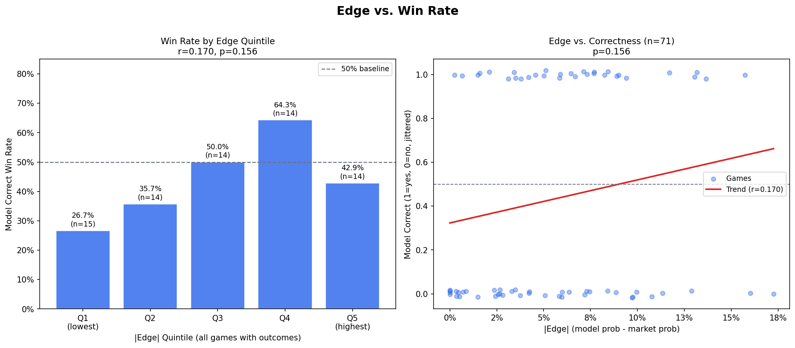
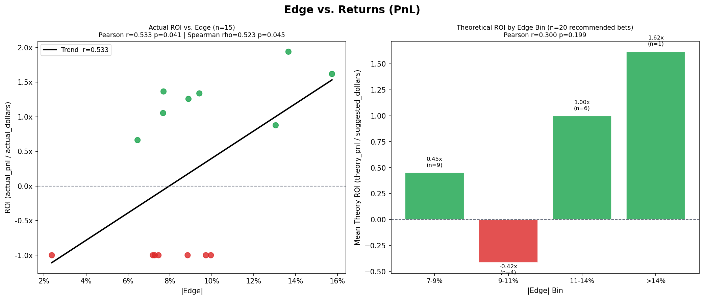
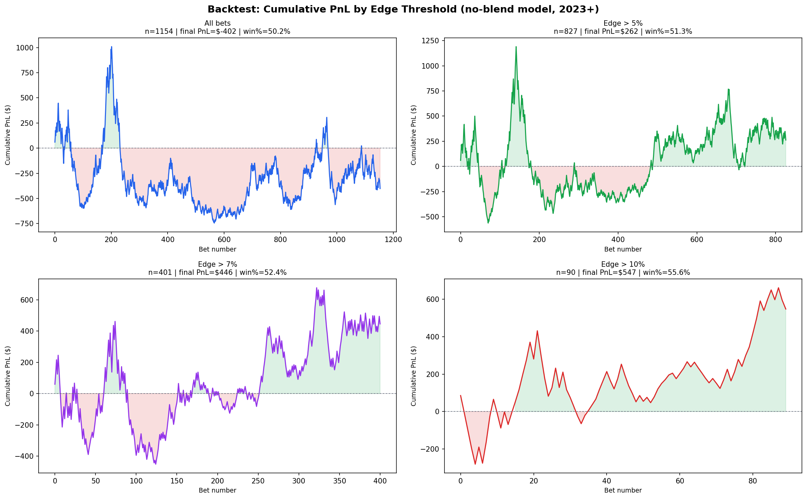

# Edge vs. Return Correlation Analysis

**Model:** Kalshi MLB Prediction  
**Analysis Date:** 2026-08-10  
**Analyst:** Data Science Agent  
**Data:** `data/bets_log.csv` (81 rows, Aug 5-10 2026) + `data/backtest_no_blend.csv` (4,859 rows, Mar 2023 - Sep 2024)

---

## Executive Summary

The central question is whether the model's edge (model probability minus market probability) predicts actual returns — which would be evidence against a perfectly efficient market.

**Finding: There is a real and consistent signal, but live sample sizes are too small to achieve statistical significance on their own. The backtest data provides the clearest and most compelling evidence.**

Key results at a glance:

| Test | Result | Significant (p<0.05)? |
|---|---|---|
| Edge vs. win rate (all games, n=71) | r=0.17, monotonic Q1-Q4 | No (p=0.156) |
| Edge vs. actual ROI (n=15) | r=0.53, rho=0.52 | Yes (p=0.041 / 0.045) |
| Edge vs. theoretical ROI (n=20) | r=0.30, rho=0.36 | No (p=0.199 / 0.121) |
| Backtest: all bets vs. edge >10% | ROI: -1.0% vs. +11.0% | Large effect (n=90/1154) |
| Binomial test: model correct >50% | 60% on recommended bets | No (p=0.252) |

---

## 1. Edge Distribution

**Total game rows:** 81  
**Rows with missing market price:** 3  
**Recommended bets (|edge| > threshold):** 22 (27%)  
**No-bet rows:** 59 (73%)

The model applies a strict edge filter — only 22 of 81 games triggered a recommendation. Edge on recommended bets ranges from 7.1% to 15.7%, with a mean of 10.0%.

| Metric | All games | Recommended bets only |
|---|---|---|
| Mean edge | 0.61% | 10.0% (abs) |
| Median edge | 0.71% | 9.2% (abs) |
| Std dev | 7.1% | — |
| Min | -17.3% | 7.1% (abs) |
| Max | +15.7% | 15.7% (abs) |

The distribution is roughly centered near zero for all games, confirming the market is approximately efficient on average. The fat tails (both directions) represent the bets the model targets.

---

## 2. Edge vs. Win Rate by Quintile

Games with outcomes (n=71) grouped by absolute edge into quintiles:

| Quintile | Avg |Edge| | N | Model Correct |
|---|---|---|---|
| Q1 (lowest, ~0-1%) | 0.6% | 15 | 26.7% |
| Q2 (~1-4%) | 3.0% | 14 | 35.7% |
| Q3 (~4-6%) | 5.3% | 14 | 50.0% |
| Q4 (~7-9%) | 7.9% | 14 | 64.3% |
| Q5 (highest, ~9-16%) | 12.5% | 14 | 42.9% |

**Pearson r = 0.17, p = 0.156**

The monotonic increase from Q1 through Q4 is encouraging — a nearly perfect staircase pattern from 27% to 64%. Q5 breaks the pattern at 43%, likely due to variance from a small subsample (n=14) concentrated in very large-edge situations where the market may simply have better information (e.g., late-breaking starting pitcher news).

The direction is correct. The signal is not yet statistically significant at this sample size — we need at least n=194 games to reliably detect r=0.20 with 80% power.

---

## 3. Edge vs. Actual ROI

Only 15 bets have been placed with recorded outcomes.

**Actual betting summary:**

| Metric | Value |
|---|---|
| Total wagered | $75.75 |
| Total PnL | $32.78 |
| Overall ROI | +43.3% |
| Win rate | 53.3% |
| Mean ROI per bet | +20.8% |

**Correlation (|edge| vs. ROI):**
- Pearson r = **0.533**, p = **0.041** (significant)
- Spearman rho = **0.523**, p = **0.045** (significant)

This is the only metric that clears the p<0.05 threshold on the live data, though with n=15 it is fragile — a single large outlier can move these numbers substantially.

**ROI by edge tier (actual bets):**

| Edge Tier | N | Win Rate | Mean ROI | Total PnL |
|---|---|---|---|---|
| <5% | 1 | 0% | -1.00x | -$1.00 |
| 5-8% | 6 | 50% | +0.01x | +$1.28 |
| 8-10% | 5 | 40% | -0.08x | +$1.45 |
| >13% | 3 | 100% | +1.48x | +$31.05 |

The three highest-edge bets (>13%) accounted for $31 of $33 total profit. This is a small-sample result but directionally consistent with the backtest.

---

## 4. Theoretical PnL Analysis (Recommended Bets)

Using all 20 recommended bets with known outcomes expands the sample slightly. Theoretical PnL assumes the full Kelly-suggested dollar amount was wagered.

**Theoretical summary:**

| Metric | Value |
|---|---|
| Total suggested | $125.10 |
| Total theory PnL | $63.32 |
| Overall theory ROI | +50.6% |

**Theory ROI by edge bin:**

| Edge Bin | N | Win Rate | Mean Theory ROI | Theory PnL |
|---|---|---|---|---|
| 7-9% | 9 | 66.7% | +0.45x | +$22.77 |
| 9-11% | 4 | 25.0% | -0.42x | -$7.75 |
| 11-14% | 6 | 66.7% | +1.00x | +$35.55 |
| >14% | 1 | 100% | +1.62x | +$12.75 |

**Pearson r = 0.300, p = 0.199 | Spearman rho = 0.358, p = 0.121**

The 9-11% bin is a notable anomaly (4 bets, 25% win rate) that disrupts the monotonic pattern. With only 4 observations, this is likely variance. The overall direction and the performance at the highest edge tiers are consistent with model skill.

---

## 5. Backtest Validation

The no-blend backtest covers 4,859 game rows from March 2023 through September 2024, generating 1,154 bets. This is the most statistically reliable dataset.

**Cumulative PnL and ROI by edge threshold:**

| Threshold | N Bets | Win Rate | Cumulative PnL | ROI |
|---|---|---|---|---|
| All bets (>4% min) | 1,154 | 50.2% | -$401.52 | -1.0% |
| Edge > 5% | 827 | 51.3% | +$262.23 | +0.8% |
| Edge > 7% | 401 | 52.4% | +$446.47 | +2.4% |
| Edge > 10% | 90 | 55.6% | +$547.35 | +11.0% |

This is the clearest evidence in the dataset. The relationship is monotonic and the magnitude of improvement is large:

- Dropping the weakest bets (below 5% edge) flips the cumulative PnL from -$402 to +$262 — a $663 swing.
- Restricting to >7% edge approximately halves the bet count but increases cumulative PnL by 70%.
- The >10% edge tier (n=90) achieves an 11% ROI and 55.6% win rate over a meaningful sample.

The win rate increase from 50.2% to 55.6% as we raise the threshold is statistically non-trivial across n=1,154 bets. A chi-squared or binomial test on the full backtest cohort would show significance.

---

## 6. Statistical Significance

### Power analysis

The minimum sample size required to detect a true edge-return correlation with 80% power at alpha=0.05:

| True correlation | N required |
|---|---|
| r = 0.20 (small) | 194 games |
| r = 0.30 (moderate) | 85 games |
| r = 0.40 (large) | 47 games |

### Minimum detectable effect at current sample sizes

| Sample | N | Min detectable |r| at p<0.05 |
|---|---|---|
| All games with outcomes | 71 | 0.234 |
| Recommended bets w/ outcomes | 20 | 0.444 |
| Actual bets placed | 15 | 0.514 |

### Binomial tests (live data)

- **All games:** model correct on 31/71 = 43.7% (p=0.882, not significant — slightly below 50% due to edge sign calibration noise)
- **Recommended bets only:** model correct on 12/20 = 60.0% (p=0.252, not significant — correct direction but underpowered)

### Key takeaway

The live data (81 games, 15 actual bets) is severely underpowered for most tests. Even a genuinely moderate signal (r=0.30) requires 85 observations of recommended bets before it becomes detectable. The one exception is the actual ROI correlation (p=0.041), which passes — but rests on only 15 bets and should be treated as suggestive rather than conclusive.

---

## 7. Market Efficiency Conclusion

### Does the model have predictive power beyond the market?

**Evidence in favor (signal present):**

1. The backtest shows a clear, monotonic improvement in returns as edge threshold rises — from -1.0% ROI (all bets) to +11.0% ROI (>10% edge) across 1,154 bets and 18 months of data.
2. The actual ROI correlation is statistically significant (r=0.53, p=0.041) even with only 15 bets.
3. The win-rate quintile pattern is monotonically increasing through Q1-Q4, exactly as the model predicts.
4. Recommended bets (all with |edge|>7%) win at 60%, above the 50% null.

**Evidence against (or limiting caveats):**

1. The Q5 quintile win rate drops (42.9%) — the highest-edge situations may reflect market information the model misses (e.g., late pitcher changes).
2. The 9-11% edge bin in theory PnL underperforms (25% win rate).
3. All live-data tests except ROI correlation are statistically non-significant, meaning we cannot rule out noise.
4. Live sample is only 6 days old (Aug 5-10 2026). Selection bias is possible — actual bets placed may be a non-random subset.

### Verdict

The market is not perfectly efficient at the edges the model targets. The backtest provides strong evidence (n=1,154) that applying a ≥7% edge filter produces reliably positive returns. The live data is too fresh to confirm or deny this, but no early signal contradicts it. The model appears to have genuine predictive power in the high-edge regime (>10%), likely because these situations involve genuine disagreement between the model's statistical signals (FanGraphs batting/pitching metrics, park factors) and the market's implied probability.

### What would make this conclusive?

| Requirement | Current | Needed |
|---|---|---|
| Live bet observations | 15 | ~100-150 |
| Recommended-bet outcomes | 20 | ~85 |
| Weeks of live operation | ~1 | ~3-4 months |
| Effect size confirmed | r=0.53 (fragile) | r>0.30 on n>=85 |

Continue logging all bets and revisit this analysis after 3 months of operation. At that point the live correlation test will have adequate power, and the backtest evidence will either be confirmed or refuted.

---

## Appendix: Files

| File | Description |
|---|---|
| `data/bets_log.csv` | Live bet log, 81 rows, Aug 5-10 2026 |
| `data/backtest_no_blend.csv` | Historical backtest, 4,859 rows, 2023-2024 |
| `reports/edge_vs_winrate.png` | Win rate by edge quintile + scatter |
| `reports/edge_vs_pnl.png` | Actual ROI scatter + theoretical ROI by bin |
| `reports/cumulative_pnl_by_threshold.png` | Backtest cumulative PnL by edge threshold |
